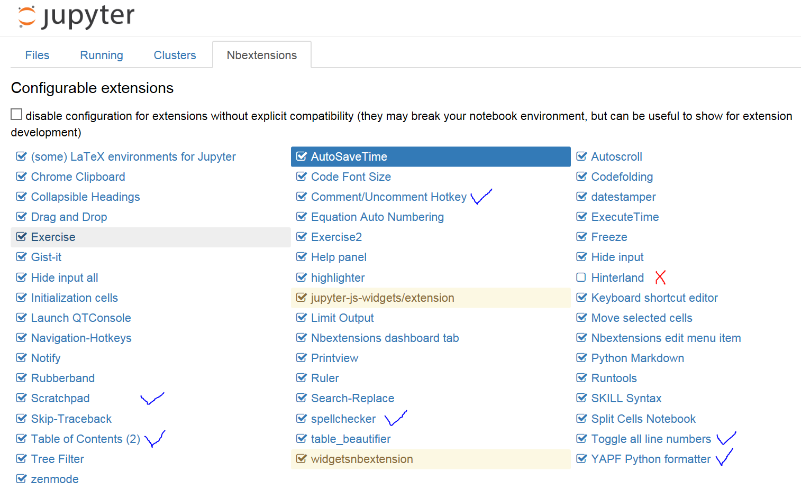

# Jupyter Tutorial

## Existing tutorials on YouTube
>[A collection of YouTube tutorials on IPython and Jupyter](https://www.youtube.com/channel/UC98x5I1LVPhtnUHDyujq7zg)

## Troubleshooting 
- Change the port of jupyter server:
>jupyter notebook --port **9999**
- Change the default browser:
 IE is not well supported by Jupyter, therefore we change the default browser from IE to Chrome or Firefox. For example, set Chrome as the default browser using the steps below:
> open the Chrome => settings => default browser

## Useful extensions 
**Reference**: [A collection of various different notebook extensions for Jupyter](https://github.com/ipython-contrib/jupyter_contrib_nbextensions)

- Install extensions by running the following commands in the terminal:
>conda install -c conda-forge jupyter_contrib_nbextensions
 
>jupyter contrib nbextension install --system
 

For Mac users, if you get an error when running the second command, you add **sudo** at the beginning of the command as follows:
 
>sudo jupyter contrib nbextension install --system

- Enable/disable the extensions:

## Handy shortcuts
- Esc
> Switch between **Command mode** and **Edit mode**
- H (in Command mode)
> Show keyboard shortcuts
- Ctrl+Enter 
> Run selected cells
- Ctrl+B
> Show/Hide the Scratchpad
- help()
> View the help document
- Shift+Enter
> Run the code in the Scratchpad
- Ctrl+S 
> Save
- Ctrl+/ 
> Comment/Uncomment
- Tab: 
> Content completion 
- L
> Show the line number
- Ctrl+L
> YAPF formatting
- Alt+X
> Run all cells
- Alt+A
> Run all cells above
- A (in command mode)
> Insect cells above
- B (in command mode)
> Insect cells below
- C (in command mode)
> Copy selected cells
- V (in command mode)
> Paste selected cells

## Built-in magic commands
**Reference**: [IPython Built-in magic commands](https://ipython.org/ipython-doc/3/interactive/magics.html)

- Line magics
    - %lsmagic
    >List currently available magic functions.

    - %load
    >Load code into the current frontend. e.g. 

    - %debug
    >Activate the debugger after an exception has fired.

- Cell magics
    - %%javascript

    >Run the cell block of Javascript code

## ipywidgets
**Reference**: 
- [ipywidgets](https://ipywidgets.readthedocs.io/en/latest/)
- [Interactive Widgets Examples](https://nbviewer.jupyter.org/github/ipython/ipython/tree/4.0.x/examples/Interactive%20Widgets/)

## Markdown + LaTeX 
**Reference**: 
* [YouTube: Markdown & LaTeX - Jupyter Tutorial (IPython 3)](https://www.youtube.com/watch?v=-F4WS8o-G2A)
* [Markdown Cheatsheet](https://github.com/adam-p/markdown-here/wiki/Markdown-Cheatsheet)

### Table

| Tables        | Are           | Cool  |
| ------------- |:-------------:| -----:|
| col 3 is      | right-aligned | 1600 |
| col 2 is      | centered      |   12 |
| zebra stripes | are neat      |    1 |

### Equation

$$y=x^2$$
where $x$ and $y$ are the length and area of a square, respectively.
 
 
For more information, please refer to: [LaTeX/Mathematics](https://en.wikibooks.org/wiki/LaTeX/Mathematics)

### Bibliography
- [BibTex In Jupyter](https://www.youtube.com/watch?v=m3o1KXA1Rjk)

## Adding other kernels
**Reference**: [IPython kernels for other languages](https://github.com/jupyter/jupyter/wiki/Jupyter-kernels)

- MATLAB
>pip install matlab_kernel

## Examples:
- [A gallery of interesting IPython Notebooks](https://github.com/ipython/ipython/wiki/A-gallery-of-interesting-IPython-Notebooks)
- [nbviewer](http://nbviewer.jupyter.org/)