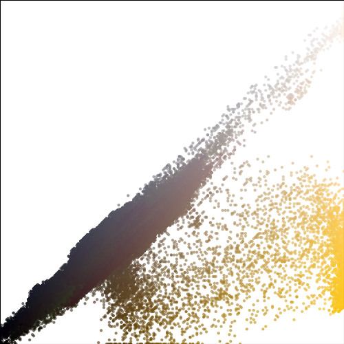

## Finding Lane Lines on the Road

  <b>Lane with solid left yellow line</b> 
	
	
   
  <b>Lane with right solid white line</b> 
	
	
   
  <b>Lane with shadow</b> 
	
	
   

### Overview
---
To develop a self-driving car, one of the critical issues is to tell the car where to go. The lines on the road that show drivers where the lanes act as a constant reference for where to steer the vehicle. This project builds an algorithm and applies Python packages to automatically detect lane lines in images.

### Getting Started
---
* [Main_pipeline.ipynb](https://github.com/YouYueHuang/SelfDrivingCarProjects/tree/master/CarND-LaneLines-P1-master/Main_pipeline.ipynb) 
This notebook contains the code to detect lane line and visualizes the processing steps.

* [examples](https://github.com/YouYueHuang/SelfDrivingCarProjects/tree/master/CarND-LaneLines-P1-master/examples) 
This directory stores the results of each step in image processing pipeline.

* [test_images](https://github.com/YouYueHuang/SelfDrivingCarProjects/tree/master/CarND-LaneLines-P1-master/test_images), [test_images_output](https://github.com/YouYueHuang/SelfDrivingCarProjects/tree/master/CarND-LaneLines-P1-master/test_images_output)
This directory contains the test images and the detected lane lines.

* [test_videos](https://github.com/YouYueHuang/SelfDrivingCarProjects/tree/master/CarND-LaneLines-P1-master/test_videos), [test_videos_output](https://github.com/YouYueHuang/SelfDrivingCarProjects/tree/master/CarND-LaneLines-P1-master/test_videos_output) 
This directory contains the test videos and the detected lane lines.

### Pipeline
---
The following steps are listed based on the image processing order. The images are the results of that step. 

  <b>Original image</b> 
  

  <b>Select region of interest</b> 
  

  <b>Scatter plot of pixel distribution in RGB color space</b>

<table>
  <tr>
    <td align="center"><b>GB distribution</b></td>
    <td align="center"><b>RB distribution</b></td>
    <td align="center"><b>RG distribution</b></td>
  </tr> 
  <tr>
    <td></td>
    <td></td>
    <td></td>
  </tr>
</table>

  <b>Color Filtering</b> 
  <a href="https://youtu.be/8WpxG8XdfZY">video</a> 
  

  <b>Gray scale transformation</b> 
  

  <b>Canny edge detection</b> 
  

  <b>Gaussian blurred processing</b> 
  

  <b>Hough line transformation</b> 
  

  <b>Distance and slope feature of Hough lines in Scatter matrix plot</b> 
  

  <b>Detected lane line after extrapolation</b> 
  

Differences from the baselines
---
* Add slope and distance feature for removing noise. The distance is defined as the average distance of end points of a Hough line. The slope feature is the slope of a Hough line. Intercept was also considers as a filter feature, but it turn out to be potential problem. Some correct lines might be removed if the threshold is not well set. Also, the threshold is hard to be generalized. The shift of the car position on the road might lead to bad filtering resulet. For instance, Sometimes no lane line is detected.

* The algorithm assumes that longer Hough lines are more likely to be lane line segments. Based on the assumption, squared Hough line length is applied as weight to calculate the mass center of the Hough lines. The slope is the average slope of the Hough lines. The mass center and the average slope are used for lane line extrapolation.

Limitations
---
* All parameters of the computer vision algorithms are chosen manually, so it is hard to generalize them. In the video of challenge, the lane line detection algorithm was seriously influenced by the enviornments such as the shadow of the trees, the the sun light, the stain on the road, etc. The results might be wrong if the images are from in other unknown environment such as rainy day.

* The region of interest is triangular, and most of the noise are from the top of the triangle (Not far from the road ahead.) These noise are caused by other cars or cluttered view. Hough line transformation wrongly detected these noise as possible lane line.   

Possible improvements
---
* Sometimes Hough line transformation wrongly detected these noise as possible lane line. One improvement could be the application of linear regression. 
In this algorithm, Canny edge detection and Guassian blurring are the preparation before Hough line transformation. After series of filtering, local contrast enhancement and sharpening could be applied to replace these processings. Next, The points can be fitted into a line with linear regression to get the lane lines.

* As for the noise from objects on the road ahead, the region of interest could be changed from triangle to trapezoid. The noise could be reduced in our examples, but a good region of interest might still vary due to the angle of camara, the condition of road, etc. 

### Reference
---
[Robust and real time detection of curvy lanes (curves) having desired slopes for driving assistance and autonomous vehicles](http://airccj.org/CSCP/vol5/csit53211.pdf)