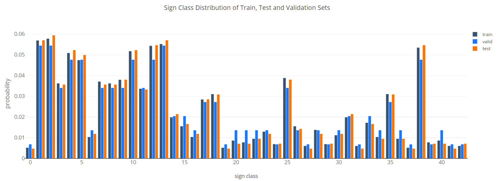
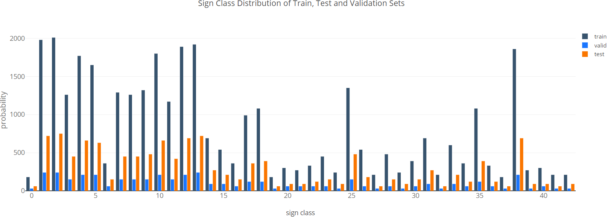

## Building a Traffic Sign Classifier

Overview
---
In this project, I will apply deep neural networks and convolutional neural networks to classify traffic signs. The traffic sign images are from [German Traffic Sign Dataset](http://benchmark.ini.rub.de/?section=gtsrb&subsection=dataset). After the model is trained, I will then try out your model on images of German traffic signs from other external sources.

Data exploration
---
Let's begin with the data exploration. The training data set consists of 43 classes of traffic sign images 32x32 in size, with the size of train set 34799 and the size of test set 12630.

Sample images of each class and its corresponding frequency in the training data set is shown below. 

Class Table
---

|ClassId	|SignName|
|---|---|
|0	|Speed limit (20km/h)|
|1	|Speed limit (30km/h)|
|2	|Speed limit (50km/h)|
|3	|Speed limit (60km/h)|
|4	|Speed limit (70km/h)|
|5	|Speed limit (80km/h)|
|6	|End of speed limit (80km/h)|
|7	|Speed limit (100km/h)|
|8	|Speed limit (120km/h)|
|9	|No passing|
|10	|No passing for vehicles over 3.5 metric tons|
|11	|Right-of-way at the next intersection|
|12	|Priority road|
|13	|Yield|
|14	|Stop|
|15	|No vehicles|
|16	|Vehicles over 3.5 metric tons prohibited|
|17	|No entry|
|18	|General caution|
|19	|Dangerous curve to the left|
|20	|Dangerous curve to the right|
|21	|Double curve|
|22	|Bumpy road|
|23	|Slippery road|
|24	|Road narrows on the right|
|25	|Road work|
|26	|Traffic signals|
|27	|Pedestrians|
|28	|Children crossing|
|29	|Bicycles crossing|
|30	|Beware of ice/snow|
|31	|Wild animals crossing|
|32	|End of all speed and passing limits|
|33	|Turn right ahead|
|34	|Turn left ahead|
|35	|Ahead only|
|36	|Go straight or right|
|37	|Go straight or left|
|38	|Keep right|
|39	|Keep left|
|40	|Roundabout mandatory|
|41	|End of no passing|
|42	|End of no passing by vehicles over 3.5 metric tons| 

Strategies
---
In the beginning, no sampling approach was appied for generating samples of a batch 

The issues
---
In the beginning 

1. Batch Normalizaion
Due to the lack of enough samples of some traffic signs, 

2. Data Augmentation
I applied data augmentation the benefit of augmenting. creates additional samples in feature-space.

creating additional training samples with affine transformation: translation, rotation, shearing and scaling

After data augmentation, the training size becomes 41469.

Some interesting questions that we sought to answer, is how much data is enough? For most classification systems, more
data is better. And more real data is better than more synthetic (Generative 
data. In none of the experiments did the performance of the
system trained on synthetic data outperform the system trained
on real data. Thus, the performance (test error %) that can be
achieved by augmenting classifier training with synthetic data,
is likely to be bounded by training on the equivalment amount
of real data.

The Architecture: The training model is built using Tensorflow containing 5 layers as described below:

* Parameters:
  * EPOCHS = 4
  * BATCH_SIZE = 150
  * LEARNING_RATE = 0.0001

* Layer 1:
  * Convolution of 5x5 kernel, 1 stride and 16 feature maps
  * Activation: ReLU
  * Pooling: 2x2 kernel and 2 stride
* Layer 2:
  * Convolution of 5x5 kernel, 1 stride and 32 feature maps
  * Activation: ReLU
  * Pooling: 2x2 kernel and 2 stride
* Layer 3:
  * Fully connected layer with 516 units
  * Activation: ReLU with dropout of 25%
* Layer 4:
  * Fully connected layer with 360 units
  * Activation: ReLU with dropout of 25%
* Layer 5:
  * Fully connected layer with 43 units for network output
  * Activation Softmax

the main key in this architecture

data augmentation
regularization

conv-relu-batchnorm is a common triplet.
Pooling reduces signal and makes the model more robust against spatial invariance1, so it can not be used very much, just the exact amount of maxpooling will make the model work fine.
We need a fully connected layer at the end to classify the images to their classes. The combination of L2 + batchnorm will act as a regularizer, preventing overfitting and keeping the weights small so that the model is able to generalize pretty well.
This architecture is quite effective in various aspects including quotient between params, complexity, time to train and accuracy.

[Example of Tensorboard](https://github.com/aymericdamien/TensorFlow-Examples/blob/master/examples/4_Utils/tensorboard_basic.py)
[Example of saving and restoring model in Tensorflow](https://github.com/aymericdamien/TensorFlow-Examples/blob/master/examples/4_Utils/save_restore_model.py)
[The code of Data augmentation](https://github.com/aleju/imgaug) from aleje.
<table>
	<tr>
		<td>Origin image</td>
		<td>Affine Transformed images</td>
	</tr> 
	<tr>
		<td></td>
		<td></td>
	</tr>
</table>

how you addressed each point.  You should include a detailed description of the code used in each step 
with line-number references and code snippets where necessary), 
links to other supporting documents or external references.  
You should include images in your writeup to demonstrate how your code works with examples.  

The Project
---
The goals / steps of this project are the following:
* Load the data set
* Explore, summarize and visualize the data set
* Design, train and test a model architecture
* Use the model to make predictions on new images
* Analyze the softmax probabilities of the new images
* Summarize the results with a written report