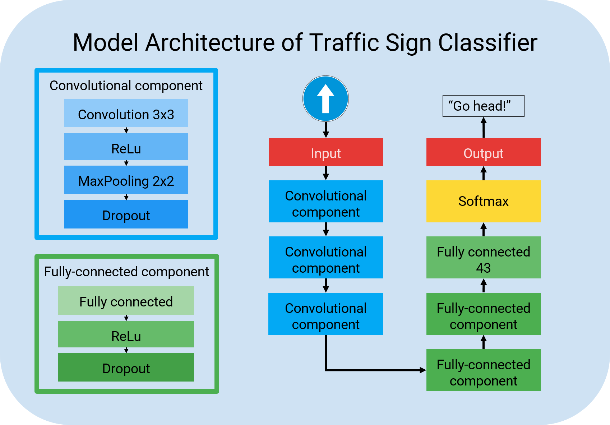
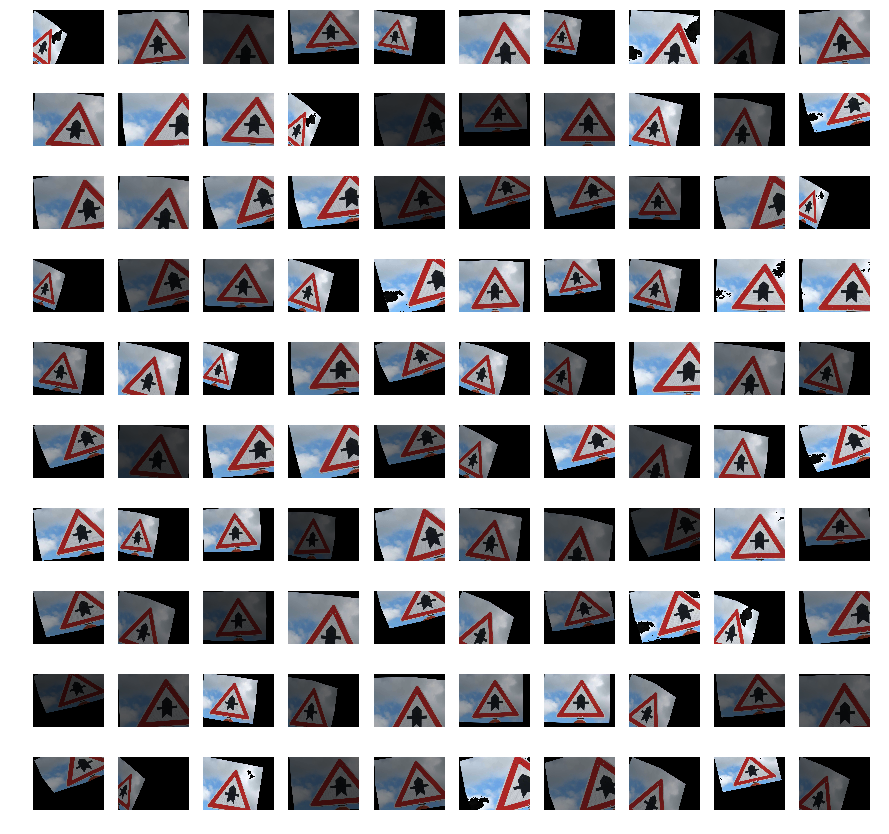
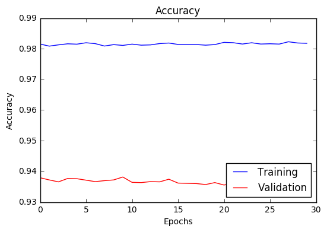
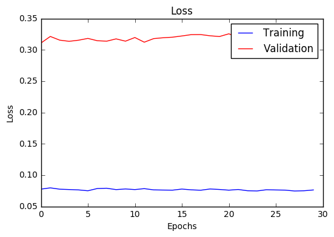

## Traffic Sign Classifier

[//]: # (Image References)

[image10]: ./img/traffic_signs.png "traffic_signs"
[image2]: ./img/dataset_histogram.png "The Histogram of training set distribution"
[image9]: ./img/distribution_of_class_frequency.PNG "Training Dataset probability distribution"
[image1]: ./img/dataset_samples.png "Dataset samples visualization"
[image3]: ./img/confusion_matrix.png "Confustion matrix of validation dataset"
[image11]: ./img/training_strategy.png "training strategy"
[image14]: ./img/preprocessed_image.png "preprocessed image"

[image4]: ./img/top5_prediction_1.png "top5 prediction of test Samples 1"
[image5]: ./img/top5_prediction_2.png "top5 prediction of test Samples 2"
[image6]: ./img/data_augmentation_histogram.png "the data number of each class after data augmentation"
[image7]: ./img/error_analysis_1.png "error analysis 1"
[image8]: ./img/error_analysis_2.png "error analysis 2"
[image12]: ./img/model_accuracy.png "model_accuracy"
[image13]: ./img/model_loss.png "model loss"
[image15]: ./img/class05.PNG "class05"
[image16]: ./img/class19.PNG "class19"



### Overview
---
In this project, deep learning techniques and convolutional neural networks were applied to classify traffic signs. The traffic sign images are from [German Traffic Sign Dataset](http://benchmark.ini.rub.de/?section=gtsrb&subsection=dataset). After training, the images of the traffic signs from the Internet were incorporated to test the performance on the model .

### File structure
---
The structure and useage of the files in this repository are as follows:

* `Main_pipeline.ipynb` and `Main_pipeline.html`
  - This part mainly contains the data exploration, visualization, preprocessing, model architecture and evaluation on test images.

* `model_ec2.ipynb`
  - Most part of this file are the same the previous one. The differences are the code and training procedure. This file was run on AWS EC2 with GPU, so more parameter tuning were tried on the files. Also, some code change on Keras was performed to solve the compatibility issue. Some details could be found in the `Readme.md` of another depository [test_on_AWS_EC2](https://github.com/YouYueHuang/test_on_AWS_EC2)

* `model_reshuffled_data.ipynb`
  - Most part of this file are the same the previous one. The only difference is the data. The training, test and validation sets are under mixing, shuffling and partitioning to recreate new datasets.

* `download_file.py`
  - This file contains the functions to download the data because the original data size is over 100 MB and it could not be uploaded to Github.

* `test_images`
  - It contains 10 images from the Internet for testing, and the file name is its class. Each image are resized to 32*32 already.
  - In web_crawler, there are 5 directories and test images with the file name of its class. They were crawled with [icrawler](https://pypi.python.org/pypi/icrawler), and the image size are not a fixed number.

* `model`
  - It contains the weight of trained model. All are in the directory of `EC2_model`

* `img`
  - It stores the images during analysis

* `test`
  - It contains some functions for preprocessing (grayscale, contrast-limited adaptive histogram equalization, histogram of oriented gradients, data augmentation, data shuffeling and partitioning, stratified sampling, Xavier weight initialization), visualization(tensorboard, graphviz), CNN model framework(inception, devolution net). 

* `ref`
  - It stores the papers of related research work.

* `logs`
  - It stores the summary of model training log in previous models, and it is mainly for visualization with TensorBoard. It is abandoned for this moment.

### Data exploration
---
* Dataset Summary
  - The training data set consists of 43 classes of colored traffic sign images 32x32 in size.
  - The number of training set: 34799.
  - The number of validation set: 4410.
  - The number of test set: 12630.

* Exploratory Visualization

<p align="center"><b>The following figure shows sample image of each class.</b></p>

![alt text][image10]

<p align="center"><b>The following figure shows the frequency distribution of training data.</b></p>

![alt text][image2]

<p align="center"><b>Normalized frequencies of each class in the training, validation and test set are shown below. It shows that the original datasets were sampled evenly for each class, so the these three sets follows the same distribution.</b></p>

![alt text][image9]

### Preprocessing
---
#### [Data augmentation](https://github.com/vxy10/ImageAugmentation)
Due to limited data and the class imbalance, additional data was generated by affine transformation to improve model generalization. After data augmentation, the size of of each class in training set is at least 600. The size of training set becomes 41469. The transformations include: 

* Rotation
* Translation
* Shearing
* Scaling while keeping the aspect ratio

Values for translation, rotation and scaling were drawn from a uniform distribution in a specified range. In this project, the values are ±10 pixels for translation, 1± 0.05 for scaling and ±15degree for rotation. As for shearing of 32x32 image, I used `(5,5)`, `(20,5)`, `(5,20)` as source points and `(pt1,5)`, `(pt2,pt1)`, `(5,pt2)` as destination points. Pt1 and Pt2 are ± 5 pixels based on 5 and 20 respectively. I got the Affine transformation matrix by using `getAffineTransform(src_Triangle, dst_Triangle)`.
`src_Triangle` and `dst_Triangle` are composed of `(5,5)`, `(20,5)`, `(5,20)` and `(pt1,5)`, `(pt2,pt1)`, `(5,pt2)`

<p align="center"><b>The examples of augmented data after Affine Transformation are shown as follows:</b></p>

<table>
  <tr>
    <td align="center">Origin image</td>
    <td align="center">Affine Transformed images</td>
  </tr> 
  <tr>
    <td></td>
    <td></td>
  </tr>
</table>
  
#### Image sharening
There are two ways to enhance the contrast of images in this projects
* Gaussian blurring 
* Contrast-limited Adaptive Histogram Equalization (CLAHE)

I used Gaussian blurring in the main pipeline, and changed to CLAHE during error analysis.

<p align="center"><b>The example of image sharpening (Speed limit (30km/h))</b></p>

![alt text][image14]

#### Normalization
The RGB value of a image was divided by 255, and the range was between 0~1.

#### Dataset shuffling
The dataset was randomly shuffled, and 20% of the data was put into a validation set. 

### Model architecture
---
#### Component
There are three types of component in this architecture 
* Conv-L2-Batchnorm-Relu 
* Maxpool-Dropout 
* Fully connection-Relu-Dropout. 

MaxPooling layer reduces signal and makes the model more robust against spatial invariance. The exact amount of maxpooling will make the model work fine and reduce the parameter. Fully connected layer are applied at the end to classify the images to their classes. 

#### Regularization
The combination of L2 and dropout will act as a regularizer, preventing overfitting and keeping the weights small so that the model is able to generalize pretty well.

#### Batch Normalizaion
It is applied for preventing the interaction of each layer and the saturation of the filters after activation.

#### Hyperparameters for Training:
* Learning rate :1e-4
* Batch size: 128
* Epoch: 60
* Keep probability: 0.1 ~ 0.3 
* Weight decay: 1e-4

Batch size determines how many examples the model look at before making a weight update. The lower it is, the noisier the training signal is going to be, the higher it is, the longer it will take to compute the gradient for each step.

The model used an ADAM optimizer, so the learning rate was not tuned manually. I set the initial learning rate 1e-4. Adaptive Moment Estimation (Adam) computes adaptive learning rates for each parameter. In addition to storing an exponentially decaying average of past squared gradients like Adadelta and RMSprop, Adam also keeps an exponentially decaying average of past gradients, similar to momentum. 

The training model is built using keras containing layers as described below, and total parameters is 427,755.

```python 
# 1: convolutional layer: kernel size 3x3 (input), L2 regularization with weight_decay 1e-4
model.add(Conv2D(32, (3,3), padding='same', kernel_regularizer=regularizers.l2(weight_decay), input_shape=X_train.shape))
model.add(BatchNormalization())
model.add(Activation('relu'))

# 2: maxpool layer: kernel size 2x2
model.add(MaxPooling2D(pool_size=(2,2), padding='same'))
model.add(Dropout(0.2))

# 3: convolutional layer: kernel size 3x3, L2 regularization with weight_decay 1e-4
model.add(Conv2D(64, (3,3), padding='same', kernel_regularizer=regularizers.l2(weight_decay)))
model.add(BatchNormalization())
model.add(Activation('relu'))

# 4: maxpool layer: kernel size 2x2
model.add(MaxPooling2D(pool_size=(2,2), padding='same'))
model.add(Dropout(0.2))

# 5: convolutional layer: kernel size 3x3, L2 regularization with weight_decay 1e-4
model.add(Conv2D(128, (3,3), padding='same', kernel_regularizer=regularizers.l2(weight_decay)))
model.add(BatchNormalization())
model.add(Activation('relu'))

# 6: maxpool layer: kernel size 2x2
model.add(MaxPooling2D(pool_size=(2,2), padding='same'))
model.add(Dropout(0.3))

model.add(Flatten())

# 7: fully-connected layter: 256 neurons
model.add(Dense(256))
model.add(Activation('relu'))
model.add(Dropout(0.3))

# 8: fully-connected layter: 128 neurons
model.add(Dense(128))
model.add(Activation('relu'))
model.add(Dropout(0.1))

# 9: fully-connected layter: 43 neurons with softmax function (output)
model.add(Dense(43))
model.add(Activation('softmax'))
```

#### Early stopping

It is applied for regularization to avoid overfitting. The accuracy of test set will increase and then decrease due to the overfitting. Therefore, if the accuracy achieve 93%, the training will be stopped.

<p align="center"><b>The workflow of model training strategy</b></p>

![alt text][image11]

**Evaluation**
  - Loss and accuracy were the metrics to validate if the model has the overfitting or underfitting issues with validation sets of 12630 samples for each epoch.
  - As long as the accuracy achieves over 93%, test sets of 4410 was fed into the model to evaluate the model.

### Result
---
**Accuracy and loss**

  - The model can achieve 99% accuracy on training set without regularization techniques(e.g, dropout, L2), but the accuracy on test set and validation set are about 93% and 93.5% respectively. The loss on training, test and validation set are 0.360, 0.401 and 0.057. 

**Confusion matrix and error analysis**

<p align="center"><b>The following figure shows confusion matrix and the performance in each class.</b></p>

![alt text][image3]

  - There are 5 parts with relatively low performace:
    1. 58 images of class 4 and 27 images of class 8 were misclassied as class 19
    2. 26 images of class 7 were misclassied as class 5
    3. 16 images of class 31 were misclassied as class 23
    4 19 images of class 16 were misclassied as class 41

  - For simplicity, only the part (1) will be discussed. Let's take two misclassified example from class 8 and class 4. The samples show that the brighness of the images are quite low.

<p align="center"><b>The following figure shows (from left to right) the misclassfied example (class 8) of the sign "Speed limit (120km/h)", its (class 8) result after sharpening, its (class 8) result after CLAHE, the example of predicted class "Dangerous curve to the left" and its (class 19) result after CLAHE</b></p>

![alt text][image7]

<p align="center"><b>The following figure shows (from left to right) the misclassfied example (class 4) of the sign "Speed limit (70km/h)", its (class 4) result after sharpening, its (class 4) result after CLAHE, the example of predicted class "Dangerous curve to the left" and its (class 19) result after CLAHE</b></p>

![alt text][image8]

  - For generalization, let's take a look for more sample from class 4 and class 19, and it is not hard to imagine why the misclassified images were recognized as the sign "Dangerous curve to the left". Most of the samples from class 19 are nearly dark, and the misclassified image(class 4) does not like most of its samples at all.

<p align="center"><b>The following figure shows more samples of the sign "Speed limit (70km/h)" (class 4)</b></p>

![alt text][image15]

<p align="center"><b>The following figure shows more samples of the sign "Dangerous curve to the left" (class 19)</b></p>

![alt text][image16]

**Top 5 prediction on new images**

Due to the fixed size of input, the images need to be resized if the size is not 32 X 32. The test accuracy are 1 for images with size of 32 X 32 and 0 for those with unfixed size. From the pictures, it is clear that the signs become unrecognizable after resizing. 


<p align="center"><b>The following figure shows top 5 prediction on 10 new images with size of 32X32</b></p>

![alt text][image4]

<p align="center"><b>The following figure shows top 5 prediction on 5 new images with random size</b></p>

![alt text][image5]

### Conclusion
---

* Model architecture and performance 
  - The high accuracy on the training set but low accuracy on the validation and test set implies overfitting. Without the dropout, the accuracy on training set can be as high as over 99%, but the performance are below 93% for other sets. The change of L2 just made the model more underfitting on both training set and validation set, so the fine-funning works are done on the adjustment of keeping probability. The policy of tuning was to reduce the difference of loss on training set and validation set while achieving 93% accuracy.

  - The accuracy of training set is about 4% higher than that of test set, and the loss is 0.25 less. Over 99% indicates there is space for improvent on training set, but the model could be generalized for test set by sacrifice the accuracy of training set 

<p align="center"><b>The following figure shows accuracy and loss on two datasets(training, test) after the measurements approach stable.</b></p>

<table>
  <tr>
    <td align="center">Accuracy of training and test set</td>
    <td align="center">Loss of training and test set</td>
  </tr> 
  <tr>
    <td></td>
    <td></td>
  </tr>
</table>

  - Without maxpool layer, the space use could be as high as 1 GB based on tensorflow. In contrast, keras takes only ~1 MB to store weight.

* Test on images from the Internet

  - When image is well processed and selected, the accuracy on test images could almost achieve accuracy of 100%, but the signs could not be recognized if we used the test images with unfixed size. The image size and ratio from the Internet are quite diverse. Without the aid of object localization, there might be many noises on the image (e.g, car, electric pole, building, etc.) After resizing, the images are seriously distorted, which makes the key features harder to be detected in the model.

* The issues in preprocessing

  - Due to the class imbalance, a data augmentation algorithm was applied to compensate the lack of traffic signs of some categories. The algorithm calculates the number of a class and decided if the image of that class needs to be generated. If the number is less than the threshold, the algorithm will generate 10 images and append them to the origin image. According to the result of error analysis, there was a trend that the misclassified images occured in series. After checking the misclassified images, it turns out that the sharpening could not enhance the contrast of the dark images well (some are even worse) so that the number of wrongly processed images were generated. If preprocessed images owns some features similar to other classes, that might confuse the model and the performance would be degenerated.

### Refrences
---
1. [Example of Tensorboard](https://github.com/aymericdamien/TensorFlow-Examples/blob/master/examples/4_Utils/tensorboard_basic.py)
2. [Example of saving and restoring model in Tensorflow](https://github.com/aymericdamien/TensorFlow-Examples/blob/master/examples/4_Utils/save_restore_model.py)
3. [The code of Data augmentation](https://github.com/aleju/imgaug) from aleje.
4. [Understanding data augmentation for classification:when to warp?](https://arxiv.org/pdf/1609.08764.pdf)
5. [improved-performance-of-deep-learning-neural-network-models-on-traffic-sign-classification](https://medium.com/@vivek.yadav/improved-performance-of-deep-learning-neural-network-models-on-traffic-sign-classification-using-6355346da2dc)
6. [How large should the batch size be for stochastic gradient descent?](https://stats.stackexchange.com/questions/140811/how-large-should-the-batch-size-be-for-stochastic-gradient-descent)
7. [GoogleNet](https://github.com/tflearn/tflearn/blob/master/examples/images/googlenet.py)
8. [Affine Transformation](https://docs.opencv.org/3.0-beta/doc/py_tutorials/py_imgproc/py_geometric_transformations/py_geometric_transformations.html)
9. [Data augmentation for traffic sign images](https://github.com/vxy10/ImageAugmentation)
10. [Multi-Column Deep Neural Network for Traffic Sign Classification](http://people.idsia.ch/~juergen/nn2012traffic.pdf)
11. [A Committee of Neural Networks for Traffic Sign Classification](http://people.idsia.ch/~juergen/ijcnn2011.pdf)
12. [CONCEPTION OF DATA PREPROCESSING AND PARTITIONING PROCEDURE FOR MACHINE LEARNING ALGORITHM](http://www.irdindia.in/journal_ijraet/pdf/vol1_iss3/27.pdf)
13. [Improved performance of deep learning neural network models for Traffic sign classification using brightness augmentation](https://medium.com/@vivek.yadav/improved-performance-of-deep-learning-neural-network-models-on-traffic-sign-classification-using-6355346da2dc)
14. [ADAM optimizer](http://ruder.io/optimizing-gradient-descent/index.html#adam)

### Appendix
---
<p align="center"><b>The following figure shows 6 images for each class to visualize the signs in a general view.</b></p>

![alt text][image1]