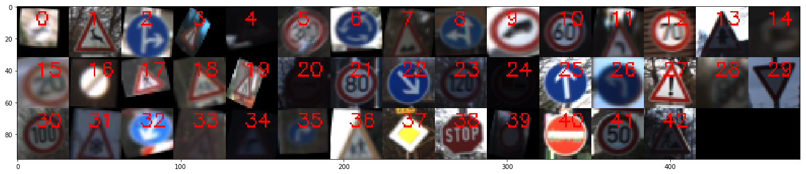

## Building a Traffic Sign Classifier

Overview
---
In this project, I will apply deep neural networks and convolutional neural networks to classify traffic signs. The traffic sign images are from [German Traffic Sign Dataset](http://benchmark.ini.rub.de/?section=gtsrb&subsection=dataset). After the model is trained, I will then try out your model on images of German traffic signs from other external sources.

Data exploration
---
Let's begin with the data exploration. 

* The training data set consists of 43 classes of colored traffic sign images 32x32 in size.
* The size of training set: 34799 
* The size of validation set: 4410.
* The size of test set: 12630.

Sample images of each class and its corresponding frequency in the training data set is shown below. 

[//]: # (Image References)

[image1]: ./img/dataset_samples.png "Dataset Samples Visualization"
[image2]: ./img/dataset_hist.png "Training Dataset Histogram"
[image9]: ./img/distribution_of_class_frequency.png "Training Dataset probability distribution"
[image3]: ./img/confusion_matrix.png "Confustion matrix of validation dataset"
[image4]: ./img/test_samples.png "Test Samples"
[image5]: ./img/test_samples_reuslts.png "Test Samples Results "
[image6]: ./img/inception_layer_featuremaps.png "Featuremaps visualization of Inception layer 1"
[image7]: ./img/inception_block.png "Inception Block"
[image8]: ./img/Network_model.png "Network Model"

The following figure shows samples of training dataset.
![alt text][image1]

Next, We plotted the histogram of Training data to give intuition on the frequency distrpution.
![alt text][image2]

Data Pipeline
---

* Dataset Preprocessing

Image normalization: subtracting mean images obtained from training dataset but this step tends to give worse accuracy. 
Dataset shuffling: In the beginning, no sampling approach was appied for generating samples of a batch 
Data Augmentation: Due to the lack of enough samples of some traffic signs, I applied data augmentation the benefit of augmenting. creates additional samples in feature-space. creating additional training samples with affine transformation: translation, rotation, shearing and scaling. After data augmentation, the training size becomes 41469.

* Model architecture: The training model is built using Tensorflow containing 5 layers as described below:

* Batch Normalizaion: It is applied for preventing the saturation of the filters after activation.

* Early stopping: I applied Early stopping for regularization to avoid overfitting

Some interesting questions that we sought to answer, is how much data is enough? For most classification systems, more data is better. Thus, the performance (test error %) that can be achieved by augmenting classifier training with synthetic data, is likely to be bounded by training on the equivalment amount of real data.

Evaluation: There is no golden rule for a good validation frequency. I computed the validation error after each epoch.

without maxpool layer: accuracy is 0.93

Some kind of nonlinearity is already present in the networks through the activation functions. Average pooling also does not introduce any additional nonlinearity, it is a linear operation so only max pooling is nonlinear. And I think the question is more if you want the regularization that pooling brings you - a little more translational invariance.

the main key in this architecture

* data augmentation
* regularization

conv-relu-batchnorm is a common triplet.
Pooling reduces signal and makes the model more robust against spatial invariance1, so it can not be used very much, just the exact amount of maxpooling will make the model work fine.
We need a fully connected layer at the end to classify the images to their classes. The combination of L2 + batchnorm will act as a regularizer, preventing overfitting and keeping the weights small so that the model is able to generalize pretty well.
This architecture is quite effective in various aspects including quotient between params, complexity, time to train and accuracy.

[Example of Tensorboard](https://github.com/aymericdamien/TensorFlow-Examples/blob/master/examples/4_Utils/tensorboard_basic.py)
[Example of saving and restoring model in Tensorflow](https://github.com/aymericdamien/TensorFlow-Examples/blob/master/examples/4_Utils/save_restore_model.py)
[The code of Data augmentation](https://github.com/aleju/imgaug) from aleje.
<table>
	<tr>
		<td>Origin image</td>
		<td>Affine Transformed images</td>
	</tr> 
	<tr>
		<td></td>
		<td></td>
	</tr>
</table>

In conclusion, we have shown that with small amounts of training data, our model show poor accuracy in prediction. With data augmentaion, the performance improved almost 50%

| Parameter         						| Without Data Augmentation	| With Data Augmentation |
|:-----------------------------------------:|:-------------------------:|:----------------------:| 
| Learning rate        						| 0.0001   					| 	0.0001				 |
| Batch size        						| 128   					| 	128					 |
| Epoch count        						| 50   						| 	50					 |
| Keep probability for Loclization network  | 0.4   					| 	0.4					 |
| Keep probability for feature maps        	| 0.5   					| 	0.5					|
| Keep probability for fully connected layer| 0.5  						| 	0.5					|
| Results        							|    						| 						|
| training set accuracy        				| 2.8 %						| 53.6%					|	
| validation set accuracy        			| 3.1%						| 48.5%					|
| test set accuracy        					| 2.4%						| 49.3%					|

<head>

</head>

<h2>Model architecture</h2>

<table>
  <tr>
    <th>Structure/Model</th>
    <th>Mynet_A</th>
    <th>Mynet_B</th>
    <th>LENET</th>
  </tr>
  <tr>
    <td>Layer 1</td>
    <td colspan=3>Convolution Activation(Relu)</td>
  </tr>
  <tr>
    <td>Layer 2</td>
    <td></td>
    <td colspan=2>MaxPooling</td>
  </tr>
  <tr>
    <td>Layer 3</td>
    <td colspan=3>Convolution Activation(Relu)</td>
  </tr>
  <tr>
    <td>Layer 4</td>
    <td></td>
    <td colspan=2>MaxPooling</td>
  </tr>
  <tr>
    <td>Layer 5</td>
    <td colspan=3>Fully connected Activation(Relu)</td>
  </tr>
  <tr>
    <td>Layer 6</td>
    <td colspan=2>Fully connected Activation(Relu)</td>
    <td>Fully connected (output)</td>
  </tr>
  <tr>
    <td>Layer 7</td>
    <td colspan=2>Fully connected (output)</td>
    <td></td>
  </tr>
</table>

### Refrences

1. Mrinal Haloi 2015 "[Traffic Sign Classification Using Deep Inception Based Convolutional Networks](https://arxiv.org/abs/1511.02992)". arXiv:1511.02992
2. Max Jaderberg and Karen Simonyan and Andrew Zisserman and Koray Kavukcuoglu 2015 "[Spatial Transformer Networks](https://arxiv.org/abs/1506.02025)". arXiv:1506.02025
3. Christian Szegedy and Vincent Vanhoucke and Sergey Ioffe and Jonathon Shlens and Zbigniew Wojna 2015 "[Rethinking the Inception Architecture for Computer Vision](https://arxiv.org/abs/1512.00567)". arXiv:1512.00567
4. https://github.com/daviddao/spatial-transformer-tensorflow
5. [visualize feature maps](http://cs231n.stanford.edu/slides/2017/cs231n_2017_lecture12.pdf)