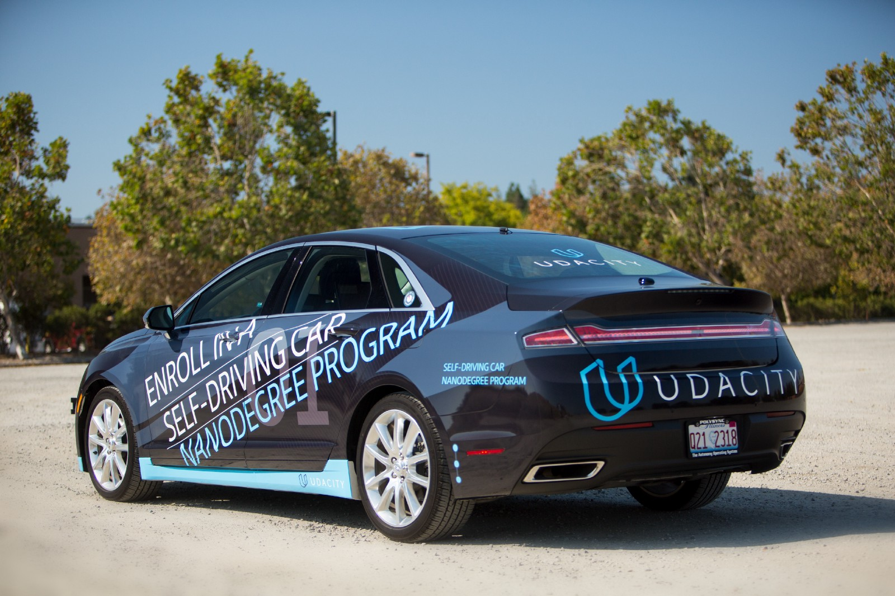

# SelfDrivingCarProjects

<!--  -->

<table style="width:100%">
  <tr>
    <th>
      
P1: Basic Lane Finding

    </th>
    <th>
      
P2: Traffic Signs Classification

    </th>
    <th>
      
P3: Behavioral Cloning

    </th>
    <th>
      
P4: Advanced Lane Finding

    </th>
    <th>
      
P5: Vehicle Detectioin

    </th>
  </tr>
  <tr>
    <th>
      

           
      

    </th>
        <th>

           
        

    </th>
       <th>

           
        

    </th>
        <th>

           
        

    </th>
        <th>

           
        

    </th>
  </tr>
</table>

## Overview

This repository is for Udacity self driving Nanodegree. The projects in this course uses the matplotlib, opencv, google tensorflow library. The working environment is based on python 3.6.1 virtualenv and jupyter notebook. 

##  Get started
------

* Download Anaconda 3.6 in official site
[Anaconda Distribution](https://www.anaconda.com/download/#windows)

* pip `conda install -c anaconda pip`

  > update pip, conda and conda-env to latest version

* Python virtual environment
  
  - create a python virtual environment named tensorflow `conda create -n tensorflow python=3.6.3`

  - activate virtual environment `activate tensorflow`

  - Deactivate virtual environment `deactivate`

* Installing a different version of Python

  - To create the new environment for Python 3.6, run `conda create -n py36 python=3.6 anaconda`
  - Do the similar for Python 2.7, run `conda create -n py36 python=3.6 anaconda`
  - To check the verision, activate the virtual environment and run `python --version`

* Jupyter Notebook 

  - install Jupyter Notebook `pip install jupyter`

  - Launch an jupyter notebook server `jupyter notebook`

* For behavior cloning,
  
  - conda install -c conda-forge eventlet
  - conda install -c conda-forge python-socketio

## Dependencies 
------
* export packages `conda list -e > requirement.txt`
* install all packages `conda create --name <env> --requirement.txt`

If you would like to install packages separately, this [link](Package_description.md) would help you. 