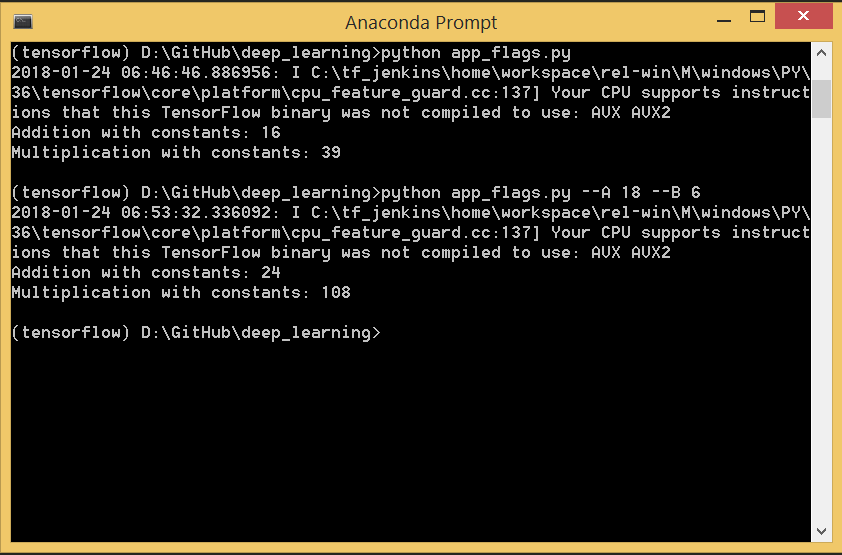

# **Useful Tools** 

Overview
---
The tools help for video clippling and GIF generating

Getting Started
---

* video clipper

<p>syntax: </p>

```shell
python video_clipper.py -i {input_file_name.mp4} start_time end_time
```

<p>The result is in the directory `clipped_video_output` </p>

* tensorflow app

> more supported parameter types could be found in https://github.com/tensorflow/tensorflow/blob/r1.4/tensorflow/python/platform/flags.py

<p>syntax: </p>

```shell
tf.app.flags.DEFINE_paraType("parameter_name", "default_value", "description")
```


* video to gif converter

<p>syntax: </p>

```shell
python video_to_gif_converter.py -i {input directory} width height
```

<p>The result is in the directory `gif_output` </p>

Issue
---
Solution for DLL load failed error when importing cv2

First solution
(1) In cmd, type `python --version` to find whether your installation is 64-bit or 32-bit
(2) download python 3.x embeddable zip file from [this link](https://www.python.org/downloads/windows/)
(3) Extract the zip file and copy python3.dll file to Anaconda3 folder

Second solution
(1) initialize new virtual environment
(2) pip install opencv-python
(3) conda install -c menpo imageio
(4) conda install ffmpeg -c conda-forge
(5) conda install -c conda-forge moviepy 